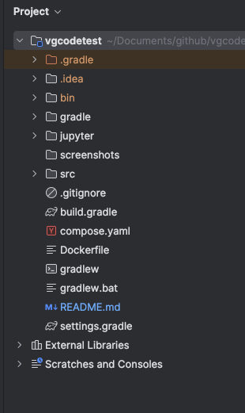

# Setup procedure

## Pre-requisite:

Your system must have:
* jvm 17 or higher
* git
* gradle
* docker
* postgres
* postman


## To Run The Application:

Start from reading this document to get the clues on what is required and steps to follow.

### To clone the repository, you require git. You can execute the command as shown below.
```shell
git clone https://github.com/lychee-wings/vgcodetest.git
```

Once the project is cloned, you should see something similar to ths. From now on, your working directory shall ALWAYS at `vgcodetest` folder.



### To run the application, you need to have Gradle and Docker.
```shell
# To build the project and to generate executable jar.
gradlew clean build

# To create containerized docker and start the application instance in docker
docker compose up --detach
```
The steps will take slightly longer when it is your first time running. Upon successfully executed both of the lines above. You should see:


or you can check on your docker desktop application for the running status of your application.


> ❗️ If and only when you encoutered issue:
> 
> * Check if the port 8080 is occupied?
>   * This can be updated in compose.yaml @ line 10. e.g. You want to quickly change to 8081 by update "8081:8080"
>

### To access API

Before start, we shall view the entities and its design.


Within `game_sales`, there are auto generated:
* `id` (generated when inserted as null)
* `created` (generated when row inserted) 
* `last_modified` (generate when row updated)

Within `ingestion_history`, there are auto generated:
* `id` (generated when inserted as null)
* `created` (generated when row inserted)
* `last_modified` (generated when row inserted)

These details can be found in the [Schema script](src/main/resources/schema-postgres.sql). It is prepare and automatically set as init script when you start the containerized run. 

```yaml

    volumes:
      - ./src/main/resources/schema-postgres.sql:/docker-entrypoint-initdb.d/schema-postgres.sql

```

Most of the env variable is set in the [compose.yaml](compose.yaml). Note that for the ease of quick launching the application, it is hardcoded.

The API that can use are as shown in [postman collection](Code%20Test%20APIs.postman_collection.json), please download it and import to Postman. Take example of `/import` csv.


> ❗️`Import` relying on the csv file in its request body, you may need to change it according to your file that is located in your directory.
> 
> There are some sample csv can be found in `src/main/resources`
> * [gameTitlesOneK.csv](src%2Fmain%2Fresources%2FgameTitlesOneK.csv) (with 1000 valid records)
> * [gameTitlesOneM.csv](src%2Fmain%2Fresources%2FgameTitlesOneM.csv) (with 1000000 valid records)
> 
> Subsequently, you may want to send the API accordingly based on the Postman collection mentioned earlier on.

📄 If you interested with how the csv generated please jump to the section below.

📄 For quick view, some of the screenshot related to API can be found below as well.

📄 Last but not least, the test cases can be found in `test` package. It can be executed when you run `gradlew build`. The **test cases are run with in memory database** with init script to ensure independency of each test. 

### To stop and clean up application (and image)

```shell
# To stop the running application
docker compose stop

# Delete the compose (containers)
docker compose rm

# Remove container image that is built
docker image rm vgcodetest-app
docker image rm postgres:15.2

# Clean up any dangling volume (could be created for postgres)
docker volume prune
```

### CSV generate procedure

A [juypter notebook](jupyter%2FgenerateCsv.ipynb) is used to manipulate the CSV for my own use. All the generated records is based on [SampleGameTitle.csv](src%2Fmain%2Fresources%2FSampleGameTitle.csv) which is download and pre-processed before the juypter script shown. 
```python
df = pd.read_csv('../src/main/resources/SampleGameTitle.csv')

df.info
```
100 game titles are selected and assigned with its `game_no`.
```python
randomized.index += 1
randomized[:100].to_csv('../src/main/resources/100GameTitle.csv',index_label='game_no')
```


But, in quick glance, you can generate 1000 valid records and 100000 valid records as shown in the last two part of the jupyter notebook when you run in sequence. The generated records will have `date_of_sale` generated randomly base on the date range.
```python
arTime = random_dates('2024-04-01', '2024-04-30', 100, 's', seed=None)
df["date_of_sale"]=df.apply(lambda row: arTime[row.name], axis=1)
```
All the csv is exported into resources folder by what has been written in the code.
```python
# For example
df[:1000000].to_csv('../src/main/resources/gameTitlesOneM.csv',index=False)
```

### API screenshots

Below are some of the screenshot. The performance can have difference on different machine and environment setup. The screenshot show here is running in my laptop.


>
> Some of the performance requirements are not met. But like mention before, it varies depending on your machine/server that deploy this application. 
> 
> The big performance difference can be seen if you have significant big resources allocated for your Docker Desktop vs you don't have.